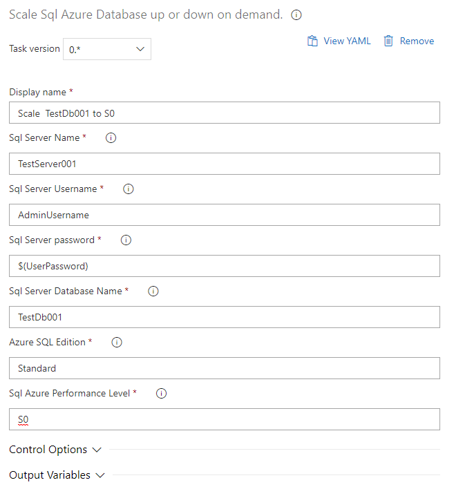

# CodeStream Scale Sql Azure Database DevOps Task

This Cutom Azure Extension task allows you to scale your Azure Sql Database on demand from Azure DevOps. 

Possible usage scenarios include:

* Scale your integration testing database prior to and after running integration tests
* Scale test environment databases up or down on a schedule to conserve costs.

## Usage

The following parameters are required in order to run this task:

* Sql Server Name
* Sql Server Username
* Sql Server Password
* Database Name
* Edition
* Performance Level

These values are configured in the task in Azure DevOps.

### Publishing new version of extension

To generate new `.vsix` file for publishing do the following:

* Update `version` attribute in `vss-extension.json` file
* Update `version` attribute in `task.json` file
* run `tfx extension create --manifest-globs vss-extension.json`

### Helpful references for creating Custom Powershell Azure Tasks

* https://docs.microsoft.com/en-us/azure/devops/extend/develop/add-build-task?view=azure-devops
* https://www.andrewhoefling.com/Blog/Post/dev-ops-vsts-custom-build-task-extension
* https://dev.to/staff0rd/publishing-a-custom-azure-pipelines-release-task-2pd
* https://github.com/microsoft/azure-pipelines-task-lib/blob/master/powershell/Docs/Consuming.md#package-the-sdk-with-the-task
